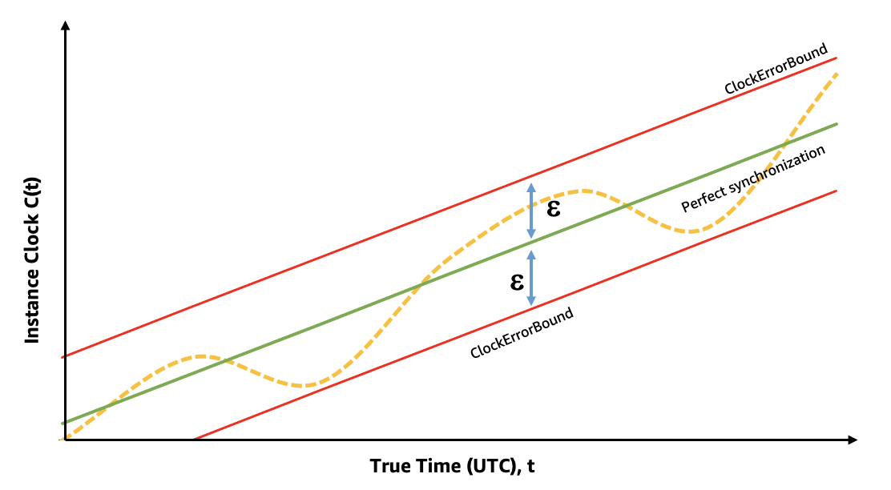

# ClockBound

## Summary:
ClockBound allows you to generate and compare bounded timestamps that include accumulated error as reported from the local chronyd process. On every request, ClockBound uses two pieces of information: the current time and the associated absolute error range, which is also known as the clock error bound. This means that the “true” time of a ClockBound timestamp is within a set range.  

Using ClockBound with a consistent, trusted time service will allow you to compare timestamps to determine order and consistency for events and transactions, independent from the instances’ respective geographic locations. We recommend you use the Amazon Time Sync Service,  a highly accurate and reliable time reference that is natively accessible from Amazon EC2 instances, to get the most out of ClockBound on your AWS infrastructure. For more information on the Amazon Time Sync Service, see the [EC2 User Guide](https://docs.aws.amazon.com/AWSEC2/latest/UserGuide/set-time.html).  

## Calculations:
Clock accuracy is a measure of clock error, typically defined as the offset to UTC. This clock error is the difference between the observed time on the computer and reference time (also known as true time). In an NTP architecture, this error can be bounded using three measurements that are defined by the protocol:
-	Local offset (the system time): The residual adjustment to be applied to the operating system clock.
-	Root dispersion: The accumulation of clock drift at each NTP server on the path to the reference clock.
-	Root delay: The accumulation of network delays on the path to the reference clock.

The clock error bound is calculated using the formula below:  

Clock Error Bound = |Local Offset| + Root Dispersion + (Root Delay / 2)  

  
Figure 1: The clock error bound provides a bound on the worst case offset of a clock with regard to “true time”.

The combination of local offset, root dispersion, and root delay provides us with a clock error bound. For a given reading of the clock C(t) at true time t, this bound makes sure that true time exists within the clock error bound. The clock error bound is used as a proxy for clock accuracy and measures the worst case scenario (see Figure 1). Therefore, clock error bound is the main metric used to determine the accuracy of an NTP service.  

ClockBound uses this clock error bound to return a bounded range of timestamps. This is calculated by adding and subtracting the clock error bound from the timestamp provided by a system's clock. It also contains functionality to check if a given timestamp is in the past or future. This allows users to have consistency when dealing with time sensitive transactions.

## Usage

ClockBound is composed of two parts:  
[ClockBoundD](clock-bound-d/README.md) - A daemon to provide clients with an error bounded timestamp interval.  
[ClockBoundC](clock-bound-c/README.md) - A client library to communicate with ClockBoundD.

To use ClockBound you first need to install and set up ClockBoundD. See the [ClockBoundD README](clock-bound-d/README.md) for more info.

Once ClockBoundD is set up you will need a client to communicate with it. The ClockBoundC client library is the recommended method of usage from a rust codebase.

### Custom Client

The [ClockBound Protocol](PROTOCOL.md) is provided if there is interest in creating a custom client.

Clients can be created in any programming language that can communicate with Unix Datagram Sockets:
1. Bind the client to its own Unix Datagram Socket.
2. Connect the client's Unix Datagram Socket to ClockBoundD's own socket.
3. Send and receive messages as defined in the [ClockBound Protocol](PROTOCOL.md).

See the implementation in [ClockBoundC](clock-bound-c/README.md) as an example.

## Security

See [CONTRIBUTING](CONTRIBUTING.md#security-issue-notifications) for more information.

## License

ClockBoundC is licensed under the [Apache 2.0 LICENSE](clock-bound-c/LICENSE).

ClockBoundD is licensed under the [GPL v2 LICENSE](clock-bound-d/LICENSE)

